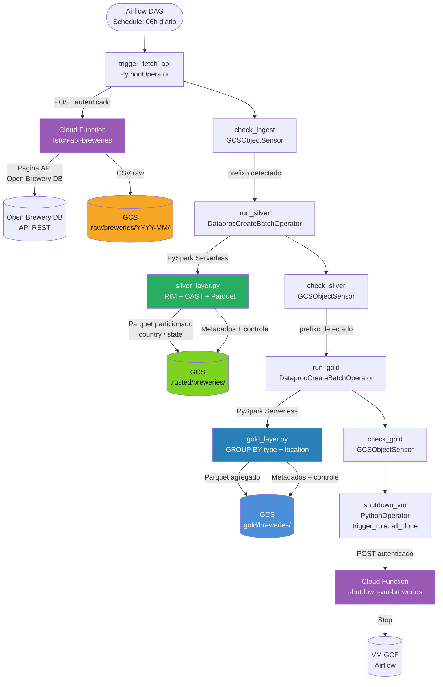

# Bees Brewery Case

Pipeline de dados ponta a ponta que consome a [Open Brewery DB API](https://www.openbrewerydb.org/), transforma e persiste os dados em um Data Lake no Google Cloud Storage seguindo a arquitetura **Medallion** (Bronze → Silver → Gold), orquestrado com Apache Airflow rodando em uma VM GCE.

---

## Índice

- [Arquitetura e Design Choices](#arquitetura-e-design-choices)
- [Estrutura do Repositório](#estrutura-do-repositório)
- [Diagrama do Pipeline](#diagrama-do-pipeline)
- [Camadas do Data Lake](#camadas-do-data-lake)
- [Como Configurar o GCP](#como-configurar-o-gcp)
- [Como Executar o Pipeline](#como-executar-o-pipeline)
- [Trade-offs e Decisões Técnicas](#trade-offs-e-decisões-técnicas)
- [Monitoramento e Alertas](#monitoramento-e-alertas)

---

## Arquitetura e Design Choices

O pipeline é construído sobre serviços **serverless e gerenciados do GCP**, eliminando a necessidade de gerenciar infraestrutura de processamento. As escolhas principais foram:

| Componente | Tecnologia | Justificativa |
|---|---|---|
| Orquestração | Apache Airflow (GCE) | Controle total de DAGs, retries e dependências |
| Ingestão (Bronze) | Cloud Function (Python) | Serverless, custo por execução, isolamento de responsabilidade |
| Processamento (Silver/Gold) | Dataproc Serverless (PySpark) | Escala automática, sem cluster fixo, paga só pelo uso |
| Storage | Google Cloud Storage | Data Lake nativo no GCP, particionamento por prefixo |
| Desligamento | Cloud Function (Python) | Garante custo zero após execução — VM Airflow desligada automaticamente |

A arquitetura separa claramente as responsabilidades: a Cloud Function de ingestão não conhece transformações, e os jobs Spark não conhecem a API. Cada camada pode ser reprocessada independentemente.

---

## Estrutura do Repositório

```
.
├── cloud_functions/
│   ├── fetch_api/
│   │   ├── main.py             # Cloud Function: extrai API e persiste CSV no GCS (Bronze)
│   │   └── requirements.txt
│   └── shutdown_vm/
│       ├── main.py             # Cloud Function: desliga a VM GCE do Airflow
│       └── requirements.txt
├── spark_jobs/
│   ├── silver_layer.py         # PySpark: Bronze → Silver (Parquet, particionado)
│   └── gold_layer.py           # PySpark: Silver → Gold (agregação analítica)
├── dags/
│   └── dag_breweries.py        # DAG Airflow: orquestra todo o pipeline
└── README.md
```

---

## Diagrama do Pipeline



---

## Camadas do Data Lake

### Bronze — `raw/breweries/YYYY-MM/`

Dados brutos da API persistidos como **CSV**, sem transformações. O particionamento por `YYYY-MM` permite reprocessamento mensal isolado e rastreabilidade histórica.

Arquivo gerado: `open_brewery_{date}_{timestamp}.csv`

Colunas preservadas: todos os campos retornados pela API (`id`, `name`, `brewery_type`, `address_1`, `city`, `state_province`, `country`, `longitude`, `latitude`, `phone`, `website_url`, `state`, `street`).

### Silver — `trusted/breweries/`

Dados transformados e persistidos como **Parquet**, particionados por `country` e `state`.

Transformações aplicadas:
- `TRIM` em todos os campos string — remove espaços acidentais da API
- `CAST` explícito para todos os tipos — garante schema consistente
- `longitude` e `latitude` convertidos para `DOUBLE`
- Colunas de controle adicionadas: `ts_proc`, `ts_proc_partition`, `ref`, `ref_partition`
- Metadados gerados por coluna: tipo, nulos, percentual de nulos, cardinalidade
- Dicionário de dados persistido em `metadados/trusted/`
- Controle de volumetria em `controle/trusted/` (append — auditável)

### Gold — `gold/breweries/`

Visão analítica agregada, persistida como **Parquet**.

Agregação: quantidade de cervejarias (`brewery_count`) agrupada por `brewery_type`, `city`, `state_province` e `country`, ordenada por volume decrescente.

Também inclui metadados e controle de volumetria, seguindo o mesmo padrão da Silver.

---

## Como Configurar o GCP

> **Atenção:** nunca suba credenciais, IDs de projeto ou nomes de bucket no repositório público. Use variáveis de ambiente e o Airflow Variables.

### 1. Pré-requisitos

- Projeto GCP criado
- `gcloud` CLI instalado e autenticado (`gcloud auth login`)
- APIs habilitadas:

```bash
gcloud services enable \
  cloudfunctions.googleapis.com \
  dataproc.googleapis.com \
  storage.googleapis.com \
  compute.googleapis.com \
  run.googleapis.com
```

### 2. Criar o Bucket GCS

```bash
gcloud storage buckets create gs://SEU_BUCKET \
  --location=southamerica-east1 \
  --uniform-bucket-level-access
```

### 3. Deploy das Cloud Functions

**fetch-api-breweries:**
```bash
cd cloud_functions/fetch_api
gcloud functions deploy fetch-api-breweries \
  --gen2 \
  --runtime=python311 \
  --region=southamerica-east1 \
  --source=. \
  --entry-point=open_brewery_extracao \
  --trigger=http \
  --set-env-vars BUCKET_NAME=SEU_BUCKET \
  --no-allow-unauthenticated
```

**shutdown-vm-breweries:**
```bash
cd cloud_functions/shutdown_vm
gcloud functions deploy shutdown-vm-breweries \
  --gen2 \
  --runtime=python311 \
  --region=southamerica-east1 \
  --source=. \
  --entry-point=shutdown_vm \
  --trigger=http \
  --set-env-vars PROJECT_ID=SEU_PROJECT,VM_NAME=SUA_VM,ZONE=southamerica-east1-b \
  --no-allow-unauthenticated
```

### 4. Upload dos Spark Jobs para o GCS

```bash
gcloud storage cp spark_jobs/silver_layer.py gs://SEU_BUCKET/spark_jobs/silver_breweries.py
gcloud storage cp spark_jobs/gold_layer.py   gs://SEU_BUCKET/spark_jobs/gold_breweries.py
```

### 5. Configurar Variáveis no Airflow

No painel do Airflow (`Admin > Variables`), criar:

| Chave | Valor |
|---|---|
| `PROJECT_ID` | ID do seu projeto GCP |
| `REGION` | `southamerica-east1` |
| `BUCKET_NAME` | Nome do bucket GCS |
| `FETCH_URL` | URL da Cloud Function `fetch-api-breweries` |
| `SHUTDOWN_URL` | URL da Cloud Function `shutdown-vm-breweries` |

### 6. Permissões IAM necessárias

A Service Account da VM Airflow precisa dos seguintes roles:

```bash
# Invocar Cloud Functions
roles/cloudfunctions.invoker

# Ler/escrever no GCS
roles/storage.objectAdmin

# Submeter jobs Dataproc
roles/dataproc.editor
```

---

## Como Executar o Pipeline

### Execução automática

O DAG `breweries_pipeline` está configurado para rodar diariamente às **06h (horário de Brasília)**:

```
schedule="0 6 * * *"
```

A VM GCE com o Airflow precisa estar ligada antes do horário de execução. Ao final do pipeline — independentemente de sucesso ou falha (`trigger_rule="all_done"`) — a task `shutdown_vm` desliga a VM automaticamente.

### Execução manual

No painel do Airflow, localize o DAG `breweries_pipeline` e clique em **Trigger DAG**.

Ou via CLI na VM:

```bash
airflow dags trigger breweries_pipeline
```

### Ordem das tasks

```
trigger_fetch_api → check_ingest → run_silver → check_silver → run_gold → check_gold → shutdown_vm
```

Cada `GCSObjectsWithPrefixExistenceSensor` garante que a camada anterior foi gravada antes de avançar. Se qualquer task falhar, o Airflow realiza até 3 retries com intervalo de 5 minutos antes de marcar como falha.

---

## Trade-offs e Decisões Técnicas

**CSV na Bronze em vez de JSON nativo**

A API retorna JSON. Optou-se por normalizar para CSV já na ingestão via pandas para facilitar a leitura pelo Spark na Silver, evitando parsing de structs aninhados. O trade-off é uma leve perda de fidelidade em campos aninhados, mas a API Open Brewery DB não possui estruturas profundamente aninhadas, tornando essa escolha segura.

**Dataproc Serverless em vez de Dataproc com cluster fixo**

Sem cluster fixo, não há custo de VM durante o tempo ocioso. O trade-off é a latência de inicialização (~2 min) a cada execução. Para um pipeline diário, essa latência é irrelevante.

**`coalesce(1)` na escrita da Gold**

A Gold é uma view agregada pequena (~poucos MB). Usar um único arquivo Parquet simplifica consumo por ferramentas de BI e queries ad-hoc. Na Silver, `coalesce(2)` equilibra paralelismo e número de arquivos.

**Airflow em VM GCE em vez de Cloud Composer**

Cloud Composer tem custo fixo elevado. Para este case, uma VM GCE com Airflow instalado e desligamento automático ao final do pipeline mantém custo próximo de zero fora do horário de execução. O trade-off é a necessidade de gerenciar a VM e garantir que esteja ligada antes do schedule.

**Particionamento Silver por `country` e `state`**

Permite que queries filtradas por país ou estado leiam apenas as partições relevantes, reduzindo custo de I/O no Dataproc e em ferramentas como BigQuery External Tables. O campo `state_province` é mantido separado de `state` para preservar a semântica original da API.

**Metadados e controle de volumetria em todas as camadas**

Cada job Spark gera automaticamente estatísticas de qualidade de dados (nulos, cardinalidade) e um dicionário de dados. Isso vai além do requisito mínimo, mas é uma prática essencial em ambientes de produção para rastreabilidade e detecção de anomalias.

---

## Monitoramento e Alertas

### O que já está implementado

- **Logs de execução:** a Cloud Function de ingestão grava um arquivo `.txt` em `logs/YYYY-MM/log_TIMESTAMP.txt` a cada execução, independentemente de sucesso ou falha.
- **Controle de volumetria:** os jobs Spark gravam em `controle/trusted/` e `controle/gold/` o número de registros processados por execução (modo `append`), permitindo detectar quedas abruptas de volume.
- **Validação entre camadas:** os `GCSObjectsWithPrefixExistenceSensor` garantem que nenhuma camada avança sem confirmar a existência dos dados da anterior.
- **Fail-fast:** `raise ValueError` nos jobs Spark aborta imediatamente se uma camada estiver vazia, evitando propagação silenciosa de dados corrompidos.

### Como evoluir para produção

- **Cloud Monitoring + Alerting:** criar alertas baseados em logs da Cloud Function (filtro por `severity=ERROR`) e notificar via e-mail ou PagerDuty.
- **Airflow Email on Failure:** configurar `email_on_failure=True` no `default_args` do DAG com SMTP configurado.
- **Anomalia de volumetria:** criar um job de validação que compara o `qtd_registros` atual com a média histórica da tabela `controle/` e falha se a variação for superior a um threshold (ex: ±30%).
- **Data Quality com Great Expectations ou Soda:** integrar checks declarativos de qualidade entre a Silver e a Gold para validar tipos, ranges e completude de campos críticos como `id`, `brewery_type` e `country`.
